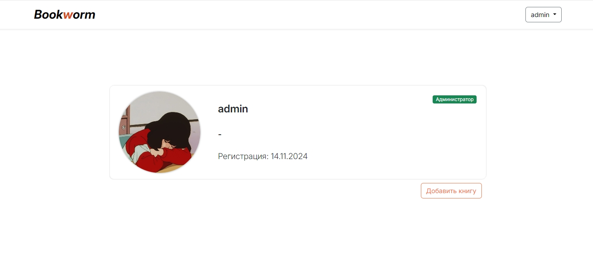

<div align="center">

<p style="text-align:center;"></p>

### Bookworm - онлайн библиотека IT-книг с возможностью комментирования и их оценки.
</div>

[](https://github.com/licaro-1/Bookworm/actions/workflows/tests.yml)
[](https://github.com/licaro-1/Bookworm/actions/workflows/cd.yml)


<details>
<summary style="font-size:25px; font-weight: bold;">Установка и запуск</summary>


1. Клонировать репозиторий
    ```bash
    git clone https://github.com/licaro-1/Bookworm.git
    ```

2. Перейти в склонированный репозиторий:
    ```bash
    cd ./Bookworm/
    ```

3. Создать виртуальное окружение и активировать его (Команды зависят от ОС)
    ```bash
    python -m venv venv
    ```
   ```bash
    . .\venv\Scripts\activate
    ```

4. Создать .env файл в директории infra и заполнить необходимые переменные из .env-example
    ```bash
    cd infra/
    ```
    ```bash
    touch .env
    ```

5. Установить зависимости
    ```bash
    pip install -r .\bookworm\requirements.txt
    ```


6. Создать файл nginx.prod.conf в директории infra/nginx 
и заполнить необходимой информацией по примеру nginx.prod.example.conf


7. Поднять docker контейнеры
   ```bash
      docker compose -f docker-compose.prod.yaml up --build
   ```

8. Запустить миграции и подгрузить статику
   ```python
   docker exec -it infra-web-1 python manage.py migrate
   docker exec -it infra-web-1 python manage.py collectstatic
   ```
9. Запустить тесты
   ```python
   docker exec -it infra-web-1 python manage.py tests
   ```
</details>

<details>
<summary style="font-size:25px; font-weight: bold; margin-top:20px;">Скриншоты</summary>


<details>
<summary style="font-size:16px; font-weight: bold; margin-top:20px;">Главная страница</summary>

<p style="font-size:14px;">Главная страница проекта с пагинацией и возможностью поиска книги по названию/описанию/автору</p>

---

<a href="assets/page_assets/main/main.jpg" target="_blank">
    
</a>


<a href="assets/page_assets/main/search.jpg" target="_blank">
    
</a>


<a href="assets/page_assets/main/pagination.jpg" target="_blank">
    
</a>


</details>


<details>
<summary style="font-size:16px; font-weight: bold; margin-top:20px;">Авторизация</summary>

<p style="font-size:14px;">Авторизация проекта с возможностью восстановления пароля через почту</p>

---


<a href="assets/page_assets/auth/auth_login.jpg" target="_blank">
    
</a>


<a href="assets/page_assets/auth/auth_register.jpg" target="_blank">
    
</a>


<a href="assets/page_assets/auth/auth_reset.jpg" target="_blank">
    
</a>


<a href="assets/page_assets/auth/auth_reset_new.jpg" target="_blank">
    
</a>

</details>


<details>
<summary style="font-size:16px; font-weight: bold; margin-top:20px;">Книга</summary>

<p style="font-size:14px;">Страница книги с наличием пагинации комментариев и возможностью комментирования, редактирования и удаления комментариев</p>

---


<a href="assets/page_assets/book/book_page.jpg" target="_blank">
    
</a>


<a href="assets/page_assets/book/comment.jpg" target="_blank">
    
</a>


<a href="assets/page_assets/book/comment_menu.jpg" target="_blank">
    
</a>


<a href="assets/page_assets/book/comment_edit.jpg" target="_blank">
    
</a>


<a href="assets/page_assets/book/comment_after_edit.jpg" target="_blank">
    
</a>


</details>


<details>
<summary style="font-size:16px; font-weight: bold; margin-top:20px;">Профиль</summary>

<p style="font-size:14px;">
Страница профиля пользователя с формой редактирования (есть возможность изменить юзернейм, имя, фамилию и аватар) и списком последних комментариев.
Для администраторов и модераторов доступна форма добавления новой книги
</p>

---

<a href="assets/page_assets/profile/profile_page_card.jpg" target="_blank">
    
</a>


<a href="assets/page_assets/profile/profile_all_comments.jpg" target="_blank">
    
</a>


<a href="assets/page_assets/profile/profile_page_form_edit.jpg" target="_blank">
    
</a>


<a href="assets/page_assets/profile/profile_page_add_book_form.jpg" target="_blank">
    
</a>

--- 
Страница всех комментариев юзера:
<a href="assets/page_assets/profile/profile_all_comments.jpg" target="_blank">
    
</a>

</details>


<details>
<summary style="font-size:16px; font-weight: bold; margin-top:20px;">Форма обратной связи</summary>

<p style="font-size:14px;">
Страница формы обратной связи. После заполнения фидбек сохраняется в БД и отправляется на почту, получатель фидбека указан в переменной окружения EMAIL_FEEDBACK_RECIPIENT 
</p>

---

<a href="assets/page_assets/feedback/feedback.jpg" target="_blank">
    
</a>


<a href="assets/page_assets/feedback/feedback_created.jpg" target="_blank">
    
</a>


<a href="assets/page_assets/feedback/feedback_notify.jpg" target="_blank">
    
</a>

</details>


</details>


## Технологии:

--- 

* Django 5
* Tinymce
* Loguru
* PostgreSQL
* Docker
* Selectel S3
* Nginx